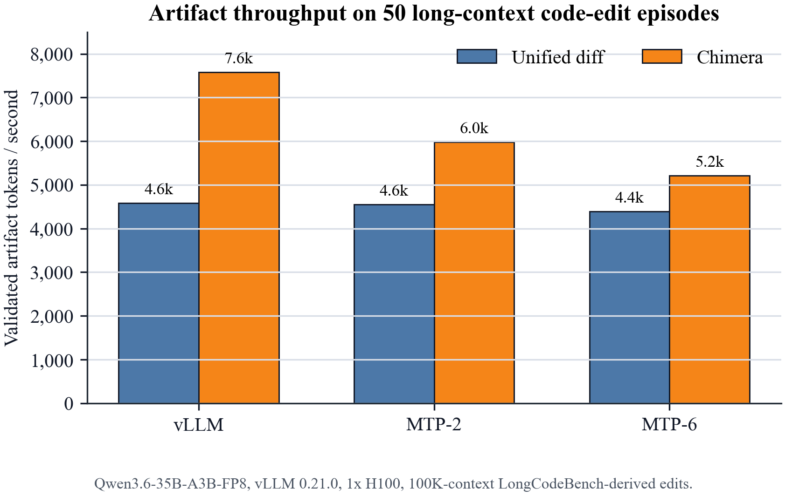
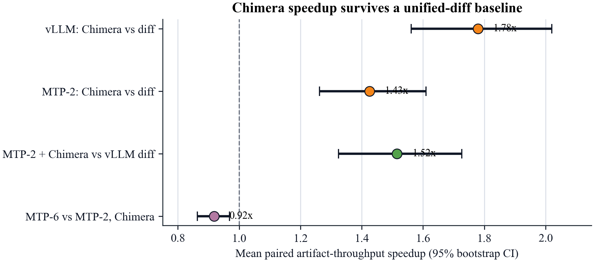
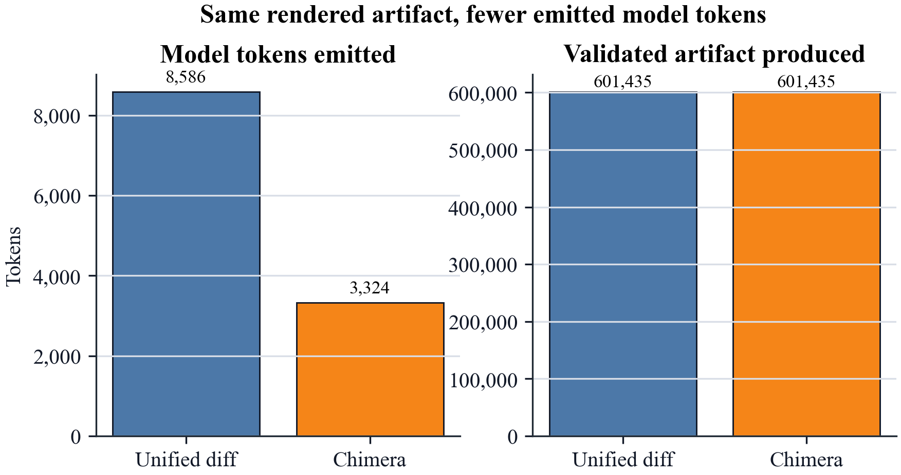
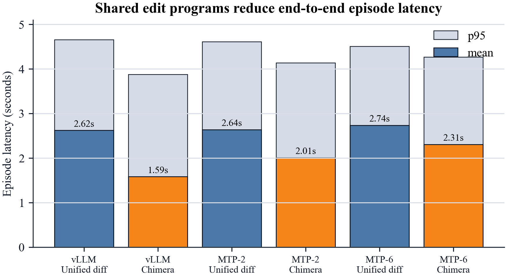

# Chimera Shared Edit Programs Paper

[](https://doi.org/10.5281/zenodo.20428058)

This repository contains a LaTeX paper draft, reproducible figures, and summary
data for the Chimera shared edit-program experiments.

## Claim

On 50 deterministic LongCodeBench-derived 100K-context file-edit episodes,
Chimera shared edit programs improve validated artifact throughput over a
minimal unified-diff baseline:

- `1.78x` mean paired speedup on normal vLLM, 95% bootstrap CI `[1.56x, 2.02x]`.
- `1.43x` mean paired speedup under vLLM Qwen MTP depth 2, 95% CI
  `[1.26x, 1.61x]`.

This is a representation-level acceleration result. It does not claim that the
transformer emits raw tokens faster.

## Key Figures

### Validated Artifact Throughput



### Paired Per-Example Speedups



### Token Accounting



### Episode Latency



## Archived Release

Version `0.1.0` is archived on Zenodo:

- DOI: [`10.5281/zenodo.20428058`](https://doi.org/10.5281/zenodo.20428058)
- Zenodo record: <https://zenodo.org/records/20428058>
- GitHub release: <https://github.com/cderinbogaz/chimera-shared-edit-programs-paper/releases/tag/v0.1.0>

## Repository Layout

```text
data/
  summary.csv
  paired_speedups.csv
paper/
  main.tex
  references.bib
  figures/
scripts/
  make_figures.py
```

## Build Figures

```bash
make figures
```

This creates vector PDF figures and 300 DPI PNG previews in `paper/figures/`.

## Build Paper

Install a LaTeX distribution with `latexmk`, then run:

```bash
make paper
```

The output PDF will be `paper/main.pdf`.

## Source Experiment

The full raw benchmark artifacts live in the companion experiment repository:

```text
experiments/009-nebius-h100-qwen36-chimera/
```

The most relevant source directories are:

- `analysis/paper50-20260527-205338/`
- `results/qwen36-fp8-vllm021-normal-1xh100-editprogram-normal-longcodebench100k-20260527-210202/`
- `results/qwen36-fp8-vllm021-mtp-1xh100-editprogram-mtp-longcodebench100k-20260527-211015/`
- `results/qwen36-fp8-vllm021-mtp-1xh100-editprogram-mtpdepth6-longcodebench100k-20260527-212827/`
- `traces/longcodebench_file_edit_paper50_100k/`
